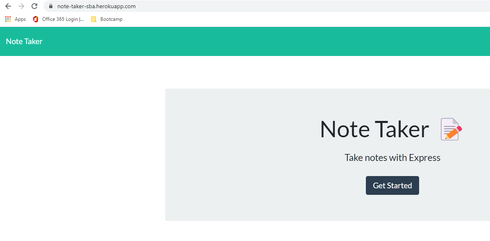
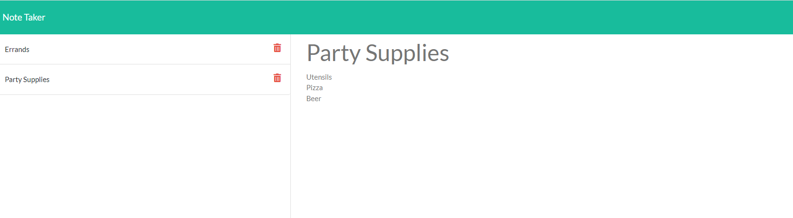
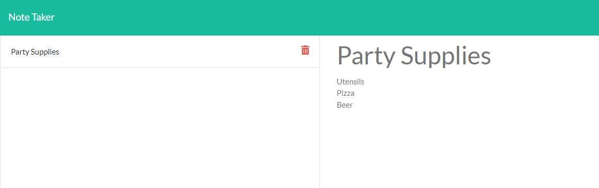

[![Contributors][contributors-shield]][contributors-url]
[![MIT License][license-shield]][license-url]

# Note Taker Application
<div>
   <p>
    View application functionality.<a href="https://drive.google.com/file/d/1JZoXdV5TGACZV1o-KaYViCPTQEoKmXEf/view"> Walkthrough Video</a><br>
    
[Deployed Application on Heroku](https://note-taker-sba.herokuapp.com/)
      
[GitHub Pages](https://nparker80.github.io/note-taker-SBA/)
     
[GitHub Repository](https://github.com/nparker80/Team-Profile-Generator)
      
  </p>
</div>

## Table of Contents
* [Description](#description)
* [Usage](#usage)
* [Tests](#tests)
* [Built With](#built-with)
* [License](#license)
* [Credits](#credits)
* [Questions](#questions)

## Description: 
This note taker application allows a user to add new notes, view saved notes and delete notes as desired. This app uses an express backend and note data is stored in a JSON file.

The welcome page where you can start the note taker application.

<br>
Sample of notes added

<br>
Sample of note deleted


<p align="right">(<a href="#top">back to top</a>)</p>

### Before attempting to use this project, install the following on your computer:
* VS Code
* GitBash
* Node.js

## Usage
1. Clone my repository to use this application on your local machine.
2. To install dependencies run the command "npm i" or "npm install" to install dependency packages needed
3. The application will be invoked by using the following command:

```bash
node server.js
```

This will start the localhost on port 3001.

4. In your browser type http://localhost:3001 to run this application on your local machine.

## Tests
* Use the command "npm test" to run Jest for tests on constructors.

<p align="right">(<a href="#top">back to top</a>)</p>

## Built With
- [Node.js](https://nodejs.org/en/)
- [Express.js](https://en.wikipedia.org/wiki/Express.js)
- [Javascript](https://www.javascript.com)
- [HTML](https://en.wikipedia.org/wiki/HTML)
- [CSS](https://developer.mozilla.org/en-US/docs/Learn/CSS/First_steps/What_is_CSS)

## License 
This project is licensed under MIT

## Credits

List of Contributors:

1. Najla Parker - Node, Express, Javascript, NPM, HTML, CSS

## Questions

Najla Parker - najla08@me.com [![LinkedIn][linkedin-shield]][linkedin-url-naj] [![GitHub][github-shield]][github-url-naj]

<p align="right">(<a href="#top">back to top</a>)</p>

<!-- MARKDOWN LINKS & IMAGES -->
<!-- https://www.markdownguide.org/basic-syntax/#reference-style-links -->

[contributors-shield]: https://img.shields.io/github/contributors/nparker80/readme-generator.svg?style=for-the-badge
[contributors-url]: https://github.com/nparker80/readme-generator/graphs/contributors
[license-shield]: https://img.shields.io/github/license/nparker80/readme-generator
[license-url]: https://github.com/nparker80/readme-generator/blob/main/LICENSE
[linkedin-shield]: https://img.shields.io/badge/-LinkedIn-black.svg?style=for-the-badge&logo=linkedin&colorB=555
[linkedin-url-naj]: https://www.linkedin.com/in/najlaparker/
[github-shield]: https://img.shields.io/badge/-Github-blueviolet.svg?style=for-the-badge&logo=Github&colorB=555
[github-url-naj]: https://github.com/nparker80
